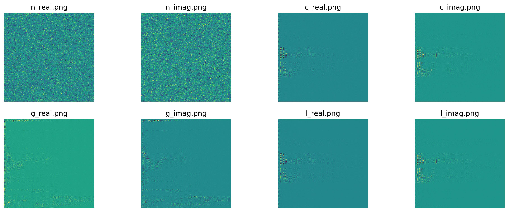
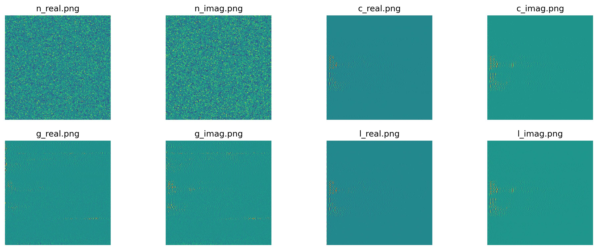
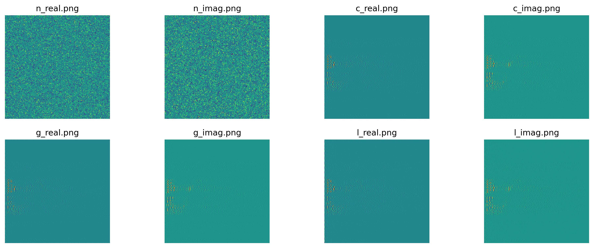

# DR-DiffuSE

---
## Brief
This is the implementation of **DR-DiffuSE** (Revisiting Denoising Diffusion Probabilistic Models for Speech Enhancement: Condition Collapse, Efficiency and Refinement) by **PyTorch**. 

[Paper]() 

In this work, we elicit generative-based speech enhancement methods (e.g., DDPM-based --) by discussing the problem of poor generalization of existing approaches. Despite the significant performance improvements in other domains like audio speech synthesis and image-to-image translation, the performance of DDPM-based speech enhancement methods is generally lower than that of other generative speech enhancement models. We investigate the following drawbacks: (i) condition collapse problem; (ii) trade-offs between effectiveness and efficiency. 

We give a deep-insight analysis of why condition collapse happens in speech enhancement and propose 3 condition-injecting strategies to ameliorate it. We further design a refinement network to (i) calibrate the output of accelerated DDPM, and (ii) train a more robust/generalizable condition generator -- which is important in Conditional DDPMs.

---

## Status
**★★★ Still working in progress ★★★**
Since the NSFC application is concentrated in March, these days are relatively busy...

### Environment Requirements
We run the code on a computer with 2 * RTX-3090, i7 13700KF, and 128G memory. Install the dependencies via anaconda:

```
# create virtual environment
conda create --name dr-diffuse python=3.8.13

# activate environment
conda activate dr-diffuse

# install pytorch & cudatoolkit
conda install pytorch torchvision torchaudio pytorch-cuda=11.7 -c pytorch -c nvidia

# install speech metrics repo:
# Note: be careful with the repo version, chiefly pesq
pip install https://github.com/ludlows/python-pesq/archive/master.zip
pip install pystoi
pip install librosa

# install utils (we use ``wandb`` for logging and ``rich`` for progress display)
pip install wandb
pip install rich
```

### Basic Architecture

We use a UNet-type model from our previous work [Foster Strengths and Circumvent Weaknesses: a Speech Enhancement Framework with Two-branch Collaborative Learning](https://arxiv.org/pdf/2110.05713.pdf) as the basic architecture for speech enhancement. We give the implementation of our basic model in ``src/model/Base.py``, which will be used as the condition generator and also, the refinement network.

### Condition Collapse Problem

To show the condition collapse phenomenon in speech enhancment, we design a model in ``src/model/DiffuSEC.py``, similar to the condition-ddpm method in **Image Super-Resolution via Iterative Refinement(SR3)** and **Palette-Image-to-Image-Diffusion-Models**. 

We train the model via running:
```
python src/train_ddpm.py --model DiffuSEC --lr 0.0002 --wandb
```
After training, we run:
```
python src/test_ddpm.py --model DiffuSEC --batch_size 1
```
Note that we save the checkpoint per epoch and automatically select the best model for evaluation, you can manually modify the path of the pre-trained model (see ``src/test_ddpm.py`` and ``src/ddpm_trainer.py``).


We show the difference between the initial gaussian, condition (noisy), generated, and ground truth:



where ``n`` denotes noise, ``c`` denotes condition, ``g`` denotes generated, and ``l`` denotes label (the compressed spec, see ``src/ddpm_trainer.py`` for more details). We can see that correlations between the generated spectrogram and the condition one is weak.

### Our solution -- DR-DiffuSE (work in progress)

**Workflow of DR-DiffuSE:**


**3 condition injecting strategies**:
- Auxiliary condition generator
- Dual-path parallel network architecture
- Non-parameterized condition guidance

**fast sampling + refine**:
- Reduce the step from ~1000 to several steps
- Design a refinement network to (i) calibrate, and (ii) improve generalization

**Architecture of DR-DiffuSE:**


**<font color=green>Auxiliary Condition Generator</font>**
The first strategy for the condition collapse problem is to design an auxiliary condition generator to get a better condition signal.

To achieve this, we first use `src/model/Base.py` as an auxiliary condition generator and train it for 10~30 epochs:
```
python src/train.py --lr 0.001 --n_epoch 30 --wandb
```
Then we train the ddpm model via running:
```
python src/train_ddpm.py --model DiffuSEC --c_gen --lr 0.0002 --wandb
```


We can see that two (test) loss curves have similar trend, and the one with better condition signal also perform better (we early-stop the training because we can forecast the trend for the next few epochs). 

After training, we run:
```
python src/test_ddpm.py --model DiffuSEC --c_gen --batch_size 1
```
Again, we show the difference between the initial gaussian, condition (processed), generated, and ground truth:


This version is slightly better compared to the vanilla one (pay attention to the color of the generated image, at least with the same background color in this version), but still lose fine-grained details.

**<font color=green>Dual-path Parallel Network Architecture</font>**
Given the loss curves above, we want to design a more fine-grained architecture for condition delivery.

We train the model via running:
```
python src/train_ddpm.py --model DiffuSE --c_gen --lr 0.0002 --wandb
```


And we show the difference between the initial gaussian, condition (processed), generated, and ground truth:



This version again, is slightly better than previous ones. However, after we calculate several metrics (e.g., pesq, stoi, ssnr, etc), we find that the condition collapse problem still exists.

**<font color=green>Non-parameterized Condition Guidance</font>**
We provide additional non-parameterized guidance during the reverse process by interpolating diffusing condition features with the intermediate output of DDPM.

$\tilde{\boldsymbol{X}}^{t}=\mathcal{N}(\boldsymbol{\mu}-2\zeta\boldsymbol{\Sigma}(\tilde{\boldsymbol{X}}^{t} - \boldsymbol{C}^t),\boldsymbol{\Sigma})$

We generate samples via:
```
python src/test_ddpm.py --model DiffuSE --c_gen --c_guidance --batch_size 1
```



We can see that the generated image is almost similar with condition signals (200 steps). We apply the fast sampling technique:
```
python src/test_ddpm.py --model DiffuSE --c_gen --c_guidance --fast_sampling --batch_size 1
```


As shown, we can generate high quality spectrogram even with 6 steps!

--- 

**<font color=red>Effciency vs. Accuracy</font>**
In this work, we follow the previous work and set T to 200. If we want to generate a sample, we need to run model iteratively (200 times), which is time-consuming. To this end, previous works propose fast sampling, generating samples with only several steps (~6 steps). However, it means we must sacrifice some performance to accelerate inference process. We show a sample here with fast sampling technique (~6 steps):


**<font color=red>Generalizability</font>**
As known, *classifier guidance* has a tight connection with the condition signal. Thus, when the auxiliary condition generator fails to generate qualified condition representation, the performance of conditional DDPM will significantly drop.

---

**<font color=blue>Denoise and Refine</font>**

Rather than making a trade-off between efficiency and accuracy, we propose a **denoise** and **refine** framework -- **DR-DiffuSE** -- first generate unperfect candidate, then refine it with a refinement network. We reuse the auxiliary condition generator as the refinement network, so that we can obtain a more robust condition generator.

We have two options for algorithm design: (i) first pre-train the auxiliary condition generator (``src/train.py``), next train ddpm (``src/train_ddpm.py``), then load pre-trained models and fine-tune them jointly. (ii) first pre-train the auxiliary condition generator (``src/train.py``), next train ddpm (``src/train_ddpm.py``) and use it to generate adversarial samples. Then, we use these adversarial samples and original datasets to fine-tune the auxiliary condition generator (``src/train.py``) with _com_mag_mse_loss_ (``src/loss.py``).

**Due to the memory issue -- for the first one, we need to restore at least 6 steps gradients of DDPM -- cut down the batchsize to avoid OOM. Thus, we use the second one in this work.**

For inference, we run:
```
python src/test_ddpm.py --model DiffuSE --c_gen --c_guidance --fast_sampling --refine --batch_size 1
```

Comparison of different generative models on VoiceBank-DEMAND dataset:


Trained on Voicebank, tested on CHIME-4:


### Acknowledgments
We would like to thank the authors of previous related projects for generously sharing their code and insights:
- [Denoising Diffusion Probabilistic Models](https://github.com/hojonathanho/diffusion)
- [DiffWave: A Versatile Diffusion Model for Audio Synthesis](https://github.com/lmnt-com/diffwave)
- [Foster Strengths and Circumvent Weaknesses: a Speech Enhancement Framework with Two-branch Collaborative Learning](https://github.com/judiebig/Foster-Strengths-and-Circumvent-Weaknesses)
- [Conditional Diffusion Probabilistic Model for Speech Enhancement](https://github.com/neillu23/CDiffuSE)
- [A Study on Speech Enhancement Based on Diffusion Probabilistic Model](https://github.com/neillu23/DiffuSE)

**Special thanks to Yen-Ju Lu for his kind help!**

### References
If you find the code useful for your research, please consider citing

```
@inproceedings{tai2023revisting,
  title={Revisiting Denoising Diffusion Probabilistic Models for Speech Enhancement: Condition Collapse, Efficiency and Refinement},
  author={Wenxin Tai and Fan Zhou and Goce Trajcevski and Ting Zhong},
  booktitle = {AAAI},
  year={2023}
}
```

### Extensions
Note that there are some recent papers that also address the condition collapse problem, we list them here for the convenience of readers.

- [Blended Diffusion for Text-driven Editing of Natural Images](https://arxiv.org/abs/2111.14818)
- [Discrete Contrastive Diffusion for Cross-Modal Music and Image Generation](https://arxiv.org/abs/2206.07771)
- [Adding Conditional Control to Text-to-Image Diffusion Models](https://arxiv.org/abs/2302.05543)
- [T2I-Adapter: Learning Adapters to Dig out More Controllable Ability for Text-to-Image Diffusion Models](https://arxiv.org/abs/2302.08453)


We are currently working on this topic. If you have any questions about this code or are interested in the condition collapse problem, feel free to contact us: ``wxtai AT outlook.com``


